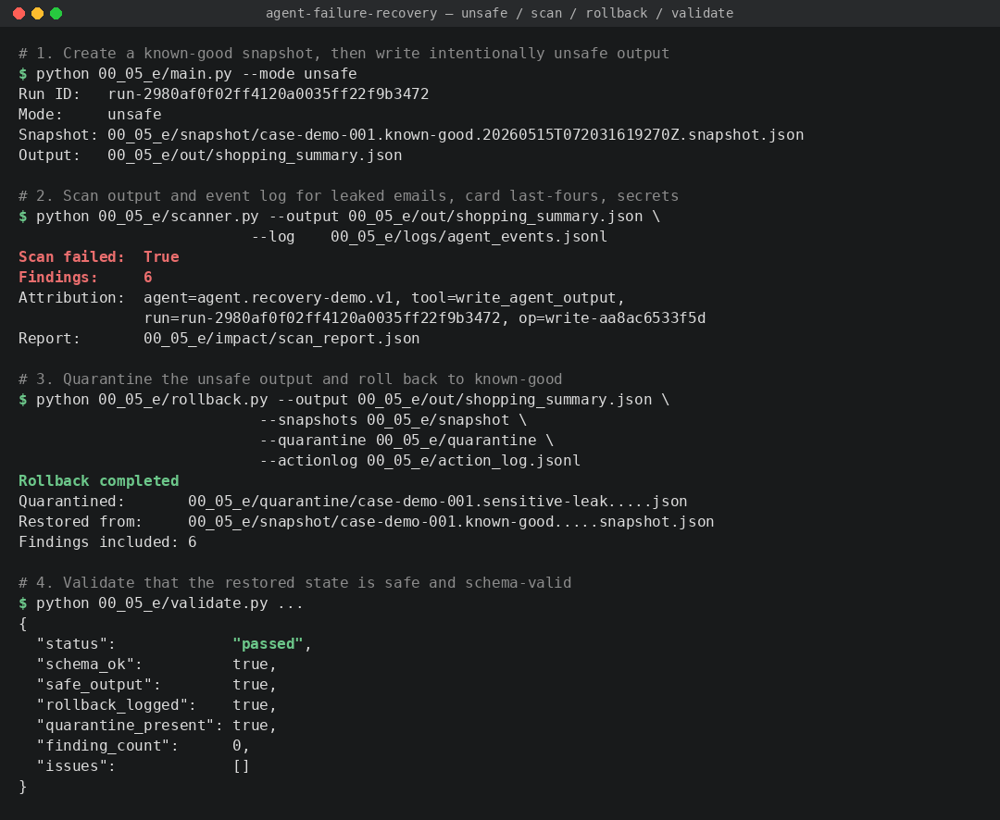

# Agent Failure Recovery Demo

A small demo of runtime controls for agentic AI systems.

The repository shows how an agent workflow can detect unsafe output, attribute the failure, assess impact, quarantine bad state, roll back to a known-good snapshot, and validate recovery.

<<<<<<< HEAD
=======
## Why this matters for AI Governance

When an agent produces unsafe output in production, governance asks four questions: *Was it caught? Who or what produced it? Can the damage be contained? Is the restored state actually safe?* This demo answers each one as a runnable step:

- **Failure detection → scanner with attribution.** `scanner.py` checks output and event logs for leaked PII (email, payment-card last-four), secret-like tokens, and sensitive keywords. When it fires, it traces the finding back to the exact agent, tool call, `run_id`, and `operation_id` that produced it. Attribution is the prerequisite for accountability.
- **Containment → quarantine + rollback to a known-good snapshot.** `rollback.py` moves the unsafe output into a quarantine area (not deleted — preserved for audit), then restores the latest known-good snapshot. The action log records what was quarantined, what was restored, and which findings triggered the action.
- **Recovery validation → schema and safety re-check after rollback.** `validate.py` confirms the restored state passes the same scanner that detected the original failure, and that the schema is still valid. "We rolled back" is not the same as "we are safe again"; validation closes that gap.

The repo is deterministic and requires no LLM API key, so the control pattern is the focus, not the model.



>>>>>>> 47bb161 (Update documentation)

## What this demo shows

- Controlled agent execution with explicit input/output contracts
- Allow-listed file access for agent reads and writes
- Structured event logging with `run_id` and `operation_id`
- Writer attribution from unsafe output back to the tool call that produced it
- Failure scanning for leaked email, payment-card last-four, secret-like tokens, and sensitive keywords
- Impact assessment against the latest known-good snapshot
- Quarantine of bad state before rollback
- Action log containing recovery evidence and triggering findings
- Recovery validation after rollback, including schema validation

## Repository structure

```text
.
├── README.md
├── requirements.txt
├── .gitignore
├── .env.example
├── LICENSE
├── NOTICE
├── .github/workflows/main.yml
└── 00_05_e/
    ├── main.py
    ├── scanner.py
    ├── assess.py
    ├── rollback.py
    ├── validate.py
    ├── guardrails.py
    ├── agent_definitions.py
    ├── observability.py
    ├── state_utils.py
    ├── agent_io.py
    ├── agent_models.py
    ├── data/shopping_notes.txt
    └── inventory/agent_inventory.json
```

Runtime folders such as `logs/`, `out/`, `snapshot/`, `quarantine/`, and `impact/` are generated locally and excluded from Git.

## Setup

```bash
python -m venv .venv
source .venv/bin/activate
pip install -r requirements.txt
```

On Windows PowerShell:

```powershell
python -m venv .venv
.\.venv\Scripts\Activate.ps1
pip install -r requirements.txt
```

No API key is required. The demo uses a deterministic local agent simulation so it can run safely in CI.

## Run the recovery workflow

Run from the repository root.

### 1. Create a known-good snapshot and intentionally unsafe output

```bash
python 00_05_e/main.py --mode unsafe
```

The script always creates a fresh known-good baseline before writing unsafe output. This prevents rollback from restoring a previously corrupted output.

### 2. Scan output and event logs for failure signals

```bash
python 00_05_e/scanner.py \
  --output 00_05_e/out/shopping_summary.json \
  --log 00_05_e/logs/agent_events.jsonl
```

### 3. Assess impact against the latest known-good snapshot

```bash
python 00_05_e/assess.py \
  --snapshots 00_05_e/snapshot \
  --current 00_05_e/out/shopping_summary.json
```

### 4. Quarantine unsafe output and roll back

```bash
python 00_05_e/rollback.py \
  --output 00_05_e/out/shopping_summary.json \
  --snapshots 00_05_e/snapshot \
  --quarantine 00_05_e/quarantine \
  --actionlog 00_05_e/action_log.jsonl
```

`rollback.py` automatically includes `00_05_e/impact/scan_report.json` findings when that file exists. You can also pass it explicitly:

```bash
python 00_05_e/rollback.py \
  --output 00_05_e/out/shopping_summary.json \
  --snapshots 00_05_e/snapshot \
  --quarantine 00_05_e/quarantine \
  --actionlog 00_05_e/action_log.jsonl \
  --scan-report 00_05_e/impact/scan_report.json
```

### 5. Validate recovery

```bash
python 00_05_e/validate.py \
  --output 00_05_e/out/shopping_summary.json \
  --snapshot 00_05_e/snapshot \
  --action-log 00_05_e/action_log.jsonl \
  --quarantine 00_05_e/quarantine
```

## Expected result

The unsafe run creates an output containing intentionally unsafe fields. The scanner detects them and attributes the writer. Rollback quarantines the bad file, restores the known-good snapshot, and validation confirms that the restored state is safe and still matches the expected schema.

## Production notes

A real production implementation should replace the local file system with durable state, central policy enforcement, typed event schemas, approval workflows, model and prompt versioning, replay tests, access controls, and operational SLOs.
